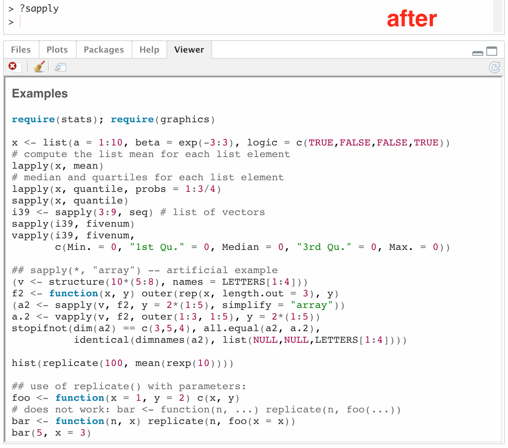

# Syntax highlighting for R HTML documentation

Overview
--------

This package enables syntax highlighting for R HTML documentation.

Syntax highlighting follows RStudio theme when running RStudio.


<!--   -->

*SOME CAVEATS*

  - *The package is still in very early stage so expect some roughness around the edges.*
  - *It has only been tested on MacOS.*

*The following issues only apply to usage inside RStudio*

  - *You might notice the highlighted doc is displayed inside RStudio Viewer pane instead of Help pane. This is a limitation. Thus things like forward, backward, ... are unavailable (for now, maybe).*
  - *If you switch between light and dark themes, you have to restart RStudio. Switching from light to light, dark to dark theme works without restarting.*


Getting Started
---------------

Install the package

```r
# install.packages("devtools")
devtools::install_github("kiendang/rdocsyntax")
```


Enable syntax highlighting

```r
rdocsyntax::use_highlight_browser()
```


If using outside RStudio, set `help_type` to `html` to automatically display doc in HTML mode. Otherwise `?` syntax won't work, have to use `help(..., help_type = "html)` instead.

```r
options(help_type = "html")
```


Enjoy R docs with colorful code

```r
?sapply
# or help(sapply, help_type = "html")
```


Extra
-----

To enable switching off syntax highlighting, *i.e.* be able to revert to original state

```r
original_browser <- rdocsyntax::use_highlight_browser()
# ...
# revert to original state
getOptions(browser = original_browser)
```
